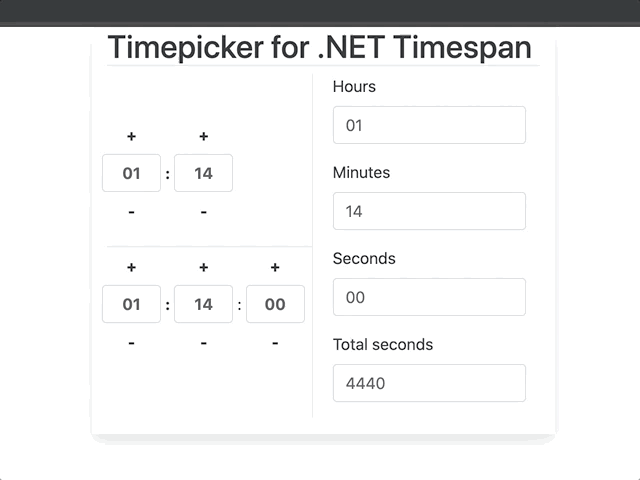

# .NET Timespan class definition for Typescript and Timepicker control for Timespan

A sample project that includes my version of <b> .NET Core's Timespan class definition for Typescript and a timepicker that works with it. </b>
<br/

## Timespan

### Constructor works with <b> D.HH:MM:SS </b> or <b> HH:MM:SS </b> time formats.

### Available methods:

addSeconds(value: number)  
addMinutes(value: number)  
addHours(value: number)  
addDays(value: number)  
add(timespan: Timespan)  
negate()  
// Toggles value negative to positive
 

## Timepicker

### Timepicker selector

selector: 'timepicker'

### Timepicker attributes

@Input() time: Timespan   
// Binding value  
 
@Input() maxMinTimeFields: boolean  
// Sets the max and min value for each field (Ex: hours = 23 minutes: 59 seconds: 59), default is false  
 
@Input() hiddenSeconds  
// Hides seconds field, default is true  
 
@Input() hourStep  
// Step amount by which hours are incremented - decremented, default is 1  
 
@Input() minuteStep   
// Step amount by which minutes are incremented - decremented, default is 1  
 
@Input() secondStep  
// Step amount by which seconds are incremented - decremented, default is 1  
 

This project was generated with [Angular CLI](https://github.com/angular/angular-cli) version 10.0.0.

## Development server

Run `ng serve` for a dev server. Navigate to `http://localhost:4200/`. The app will automatically reload if you change any of the source files.

## Code scaffolding

Run `ng generate component component-name` to generate a new component. You can also use `ng generate directive|pipe|service|class|guard|interface|enum|module`.

## Build

Run `ng build` to build the project. The build artifacts will be stored in the `dist/` directory. Use the `--prod` flag for a production build.

## Running unit tests

Run `ng test` to execute the unit tests via [Karma](https://karma-runner.github.io).

## Running end-to-end tests

Run `ng e2e` to execute the end-to-end tests via [Protractor](http://www.protractortest.org/).

## Further help

To get more help on the Angular CLI use `ng help` or go check out the [Angular CLI README](https://github.com/angular/angular-cli/blob/master/README.md).
